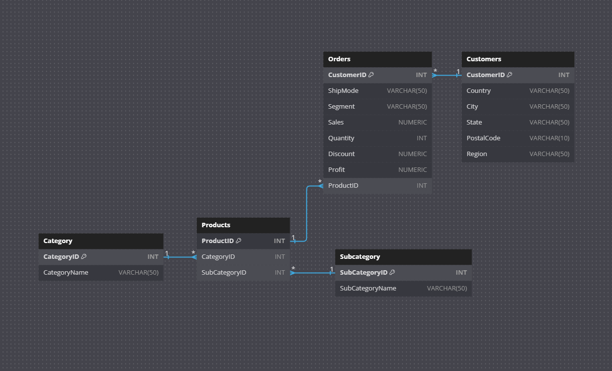

# SQL Data Analysis

# Create Tables
-- Create Category Table
CREATE TABLE Category (
    CategoryID SERIAL PRIMARY KEY,
    CategoryName VARCHAR(50)
);

-- Create Subcategory Table
CREATE TABLE Subcategory (
    SubCategoryID SERIAL PRIMARY KEY,
    SubCategoryName VARCHAR(50)
);

-- Create Products Table
CREATE TABLE Products (
    ProductID SERIAL PRIMARY KEY,
    CategoryID INTEGER REFERENCES Category(CategoryID),
    SubCategoryID INTEGER REFERENCES Subcategory(SubCategoryID)
);

-- Create Customers Table
CREATE TABLE Customers (
    CustomerID SERIAL PRIMARY KEY,
    Country VARCHAR(50),
    City VARCHAR(50),
    State VARCHAR(50),
    PostalCode VARCHAR(10),
    Region VARCHAR(50)
);

-- Create Orders Table
CREATE TABLE Orders (
    CustomerID SERIAL PRIMARY KEY,
    ShipMode VARCHAR(50),
    Segment VARCHAR(50),
    Sales NUMERIC,
    Quantity INTEGER,
    Discount NUMERIC,
    Profit NUMERIC,
    ProductID INTEGER REFERENCES Products(ProductID)
);

# Import the Data

-- Import data into Category table
COPY Category (CategoryID,CategoryName)
FROM '/Portfolio/main/Project_2/Category.csv'
DELIMITER ';' CSV HEADER;

-- Import data into Subcategory table
COPY Subcategory (SubCategoryID,SubCategoryName)
FROM '/Portfolio/main/Project_2/Subcategory.csv'
DELIMITER ';' CSV HEADER;

-- Import data into Products table
COPY Products (ProductID,CategoryID, SubCategoryID)
FROM '/Portfolio/main/Project_2/Product.csv'
DELIMITER ';' CSV HEADER;

-- Import data into Customers table
COPY Customers (CustomerID,Country, City, State, PostalCode, Region)
FROM '/Portfolio/main/Project_2/Customer.csv'
DELIMITER ';' CSV HEADER;

-- Import data into Orders table
COPY Orders (CustomerID, ProductID, ShipMode, Segment, Sales, Quantity, Discount, Profit) 
FROM '/Portfolio/main/Project_2/Order.csv'
DELIMITER ';' CSV HEADER;

# Basic Information:
### How many categories are there in the dataset?

SELECT COUNT(categoryID) as Number_Of_Categories FROM category;

| number_of_categories | 3 |
| -------------------- | - |

### How many subcategories are there in the dataset?

SELECT COUNT(subcategoryID) AS Number_Of_Subcategories FROM subcategory;

| number_of_subcategories | 17 |
| ----------------------- | -- |

### What are the unique countries represented in the Customers table?

SELECT COUNT(DISTINCT country) as Number_Of_Countries FROM customers;

| number_of_countries | 1 |
| ------------------- | - |

### What is the total number of customers in the dataset?

SELECT COUNT(customerID) as Number_Of_Customers FROM customers;

| number_of_customers | 9994 |
| ------------------- | ---- |

# Tables analysis
## 1. Product Analysis:

### Which category has the highest number of products?

SELECT category.categoryName, COUNT(products.productID) AS NumberOfProducts
FROM products
JOIN category ON category.categoryID = products.categoryID
GROUP BY category.categoryName
ORDER BY NumberOfProducts DESC
LIMIT 1;

| categoryname      | numberofproducts |
| ----------------- | ---------------- |
| Office Supplies   | 10               |

### What is the average quantity of products ordered per order?

SELECT ROUND(AVG(quantity),2) AS Average_Quantity_per_Order FROM orders

| average_quantity_per_order | 3.79 |
| ------------------- | ---- |

### Which products has the highest sales value?

SELECT subcategory.subcategoryname, SUM(orders.sales) AS Total_Sales 
FROM orders
JOIN products ON orders.productID = products.productID
JOIN subcategory ON products.subcategoryID= subcategory.subcategoryID
GROUP BY subcategory.subcategoryname
ORDER BY Total_Sales DESC;

| subcategoryname | total_sales   |
| --------------- | ------------- |
| Bookcases       | 198348349.44  |
| Chairs          | 169899880.93  |
| Phones          | 145178587.48  |
| Tables          | 128591956.63  |
| Binders         | 94299543.42   |
| Copiers         | 54374438.84   |
| Storage         | 50496688.44   |
| Machines        | 49401737.87   |
| Accessories     | 29761964.11   |
| Furnishings     | 22376122.44   |
| Paper           | 18913561.27   |
| Appliances      | 18575942.26   |
| Supplies        | 13535699.01   |
| Art             | 7128921.88    |
| Envelopes       | 4941538.41    |
| Labels          | 2092196.52    |
| Fasteners       | 902923.48     |

### Which products has the highest profit value?

SELECT subcategory.subcategoryname, SUM(orders.profit) AS Total_Profit 
FROM orders
JOIN products ON orders.productID = products.productID
JOIN subcategory ON products.subcategoryID= subcategory.subcategoryID
GROUP BY subcategory.subcategoryname
ORDER BY Total_Profit DESC;

| subcategoryname | total_profit  |
| --------------- | ------------- |
| Copiers         | 384550310     |
| Phones          | 301602758     |
| Accessories     | 246861121     |
| Paper           | 222609249     |
| Binders         | 164183103     |
| Storage         | 162943863     |
| Chairs          | 136776004     |
| Appliances      | 121852257     |
| Furnishings     | 89974081      |
| Envelopes       | 43047154      |
| Labels          | 38903263      |
| Art             | 36293437      |
| Machines        | 30895607      |
| Fasteners       | 5202681       |
| Supplies        | -20860498     |
| Bookcases       | -26266313     |
| Tables          | -141740583    |

## 2. Customer Analysis:

### How many customers are located in each region,state and city?

#### Region
SELECT region, COUNT(customerID) FROM customers
GROUP BY region;

| region   | count |
| -------- | ----- |
| South    | 1620  |
| West     | 3203  |
| East     | 2848  |
| Central  | 2323  |

#### State

SELECT state, COUNT(customerID) FROM customers
GROUP BY state;

| state                | count |
| -------------------- | ----- |
| Oklahoma             | 66    |
| Colorado             | 182   |
| North Carolina       | 249   |
| Mississippi          | 53    |
| Florida              | 383   |
| Vermont              | 11    |
| Delaware             | 96    |
| Nevada               | 39    |
| Louisiana            | 42    |
| New York             | 1128  |
| West Virginia        | 4     |
| New Jersey           | 130   |
| South Carolina       | 42    |
| Arkansas             | 60    |
| New Mexico           | 37    |
| Missouri             | 66    |
| Connecticut          | 82    |
| South Dakota         | 12    |
| District of Columbia| 10    |
| Iowa                 | 30    |
| Indiana              | 149   |
| Massachusetts        | 135   |
| Rhode Island         | 56    |
| Ohio                 | 469   |
| Michigan             | 255   |
| Minnesota            | 89    |
| Pennsylvania         | 587   |
| Washington           | 506   |
| Montana              | 15    |
| Wisconsin            | 110   |
| Kentucky             | 139   |
| Arizona              | 224   |
| Illinois             | 492   |
| Virginia             | 224   |
| Maryland             | 105   |
| Georgia              | 184   |
| Wyoming              | 1     |
| Utah                 | 53    |
| New Hampshire        | 27    |
| North Dakota         | 7     |
| Maine                | 8     |
| Nebraska             | 38    |
| California           | 2001  |
| Tennessee            | 183   |
| Kansas               | 24    |
| Oregon               | 124   |
| Texas                | 985   |
| Idaho                | 21    |
| Alabama              | 61    |

#### City
SELECT city, COUNT(customerID) FROM customers
GROUP BY city
ORDER BY count DESC
LIMIT 20;

| city           | count |
| -------------- | ----- |
| New York City  | 915   |
| Los Angeles    | 747   |
| Philadelphia   | 537   |
| San Francisco  | 510   |
| Seattle        | 428   |
| Houston        | 377   |
| Chicago        | 314   |
| Columbus       | 222   |
| San Diego      | 170   |
| Springfield    | 163   |
| Dallas         | 157   |
| Jacksonville   | 125   |
| Detroit        | 115   |
| Newark         | 95    |
| Richmond       | 90    |
| Jackson        | 82    |
| Columbia       | 81    |
| Aurora         | 68    |
| Phoenix        | 63    |
| Long Beach     | 61    |

## 2. Order Analysis:

### Which Segment order more products and is more profitable?

SELECT segment,SUM(quantity) as Quantity_Orders FROM orders
GROUP BY segment;

| segment      | quantity_orders |
| ------------ | ---------------- |
| Consumer     | 19521            |
| Corporate    | 11608            |
| Home Office  | 6744             |

### Which Segment is more profitable?

SELECT segment, SUM(profit) AS Total_Profit_per_Segment from orders
GROUP BY segment;

| segment      | total_profit_per_segment |
| ------------ | ------------------------ |
| Consumer     | 908,834,302              |
| Corporate    | 509,067,264              |
| Home Office  | 378,925,928              |

### What are the shipping modes used for each segment of orders, and how many orders were shipped using each mode?

SELECT segment,shipmode,COUNT(shipmode) as Num_Of_Shipping FROM orders
GROUP BY segment,shipmode
ORDER BY Num_Of_Shipping DESC;

| segment     | shipmode       | num_of_shipping |
| ----------- | -------------- | --------------- |
| Consumer    | Standard Class | 3085            |
| Corporate   | Standard Class | 1812            |
| Home Office | Standard Class | 1071            |
| Consumer    | Second Class   | 1020            |
| Consumer    | First Class    | 769             |
| Corporate   | Second Class   | 609             |
| Corporate   | First Class    | 485             |
| Consumer    | Same Day       | 317             |
| Home Office | Second Class   | 316             |
| Home Office | First Class    | 284             |
| Corporate   | Same Day       | 114             |
| Home Office | Same Day       | 112             |

### What is the total profit generated for each shipping mode within each segment of orders,and how does it vary across different modes and segments?

SELECT segment,shipmode,SUM(profit) as Sum_of_Profits FROM orders
GROUP BY segment,shipmode
ORDER BY Sum_of_Profits DESC;

### Which segment pursue more discounts?

SELECT segment,COUNT(discount) as Discounts FROM orders
GROUP BY segment
ORDER BY COUNT(discount) DESC
LIMIT 1

| segment     | shipmode       | sum_of_profits |
| ----------- | -------------- | -------------- |
| Consumer    | Standard Class | 511,772,263    |
| Corporate   | Standard Class | 353,784,948    |
| Consumer    | First Class    | 160,933,344    |
| Consumer    | Second Class   | 160,096,870    |
| Home Office | Standard Class | 150,731,065    |
| Home Office | Second Class   | 107,652,985    |
| Corporate   | Second Class   | 102,609,260    |
| Home Office | First Class    | 95,378,178     |
| Consumer    | Same Day       | 76,031,825     |
| Corporate   | First Class    | 75,149,562     |
| Home Office | Same Day       | 25,163,700     |
| Corporate   | Same Day       | -22,476,506    |

### For each segment, which category generates the highest total sales?

SELECT segment, category.CategoryName, SUM(orders.Sales) AS Total_Sales
FROM orders
JOIN products ON orders.ProductID = products.ProductID
JOIN category ON products.CategoryID = category.CategoryID
GROUP BY segment, category.CategoryName
ORDER BY segment, Total_Sales DESC;

| segment     | categoryname    | total_sales    |
| ----------- | --------------- | -------------- |
| Consumer    | Furniture       | 285,386,223.99|
| Consumer    | Office Supplies | 160,835,653.47|
| Consumer    | Technology      | 91,122,433.65 |
| Corporate   | Furniture       | 171,881,532.97|
| Corporate   | Office Supplies | 77,296,257.07 |
| Corporate   | Technology      | 46,090,145.18 |
| Home Office | Furniture       | 80,862,113.75 |
| Home Office | Office Supplies | 57,617,719.59 |
| Home Office | Technology      | 37,727,972.76 |

# Advanced Analysis:

### What is the correlation between sales, profit, and quantity for each segment of orders?

SELECT segment,
	CORR(Sales, Profit) AS Sales_Profit_Correlation,
    CORR(Sales, Quantity) AS Sales_Quantity_Correlation,
    CORR(Profit, Quantity) AS Profit_Quantity_Correlation
FROM orders
GROUP BY segment;

| segment     | sales_profit_correlation | sales_quantity_correlation |
| ----------- | ------------------------ | -------------------------- |
| Consumer    | -0.06370883343167401     | 0.09917779147501823        |
| Corporate   | -0.05163168427728129     | 0.09249327542660409        |
| Home Office | 0.42703440345015214      | 0.0827026958791403         |

###Consumer Segment:
#### Sales-Profit Correlation (-0.0637): There is a very weak negative correlation between sales and profit for the Consumer segment. This suggests that as sales increase, profit tends to decrease slightly, but the correlation is not strong.
#### Sales-Quantity Correlation (0.0992): There is a weak positive correlation between sales and quantity for the Consumer segment. This means that as sales increase, the quantity of products sold also tends to increase slightly.
#### Profit-Quantity Correlation (0.0435): There is a very weak positive correlation between profit and quantity for the Consumer segment. This suggests that as the quantity of products sold increases, profit tends to increase slightly, but the correlation is not strong.
### Corporate Segment:
#### Sales-Profit Correlation (-0.0516): There is a very weak negative correlation between sales and profit for the Corporate segment. Similar to the Consumer segment, this suggests that as sales increase, profit tends to decrease slightly, but the correlation is not strong.
#### Sales-Quantity Correlation (0.0925): There is a weak positive correlation between sales and quantity for the Corporate segment. As sales increase, the quantity of products sold also tends to increase slightly.
#### Profit-Quantity Correlation (0.0815): There is a weak positive correlation between profit and quantity for the Corporate segment. As the quantity of products sold increases, profit tends to increase slightly.

### Home Office Segment:
#### Sales-Profit Correlation (0.4270): There is a moderate positive correlation between sales and profit for the Home Office segment. This suggests that as sales increase, profit tends to increase significantly.
#### Sales-Quantity Correlation (0.0827): There is a weak positive correlation between sales and quantity for the Home Office segment. As sales increase, the quantity of products sold also tends to increase slightly.
#### Profit-Quantity Correlation (0.1002): There is a weak positive correlation between profit and quantity for the Home Office segment. As the quantity of products sold increases, profit tends to increase slightly.

### Most sold types of products based on cities.

SELECT 
    customers.city,
    subcategory.subcategoryname as Product_Type,
    COUNT(*) AS Frequency
FROM 
    customers
JOIN 
    orders ON customers.CustomerID = orders.CustomerID
JOIN 
    products ON orders.ProductID = products.ProductID
JOIN 
    subcategory ON products.SubCategoryID = subcategory.SubCategoryID
GROUP BY 
    customers.city,
    subcategory.subcategoryname
ORDER BY Frequency DESC
LIMIT 25;

| City           | Product Type | Frequency |
|----------------|--------------|-----------|
| New York City  | Binders      | 145       |
| New York City  | Paper        | 124       |
| Los Angeles    | Paper        | 118       |
| Los Angeles    | Binders      | 98        |
| New York City  | Phones       | 89        |
| Philadelphia   | Binders      | 87        |
| New York City  | Storage      | 82        |
| New York City  | Furnishings  | 78        |
| Seattle        | Binders      | 75        |
| Los Angeles    | Phones       | 74        |
| San Francisco  | Binders      | 74        |
| San Francisco  | Paper        | 74        |
| New York City  | Art          | 70        |
| Los Angeles    | Art          | 66        |
| New York City  | Accessories  | 64        |
| Los Angeles    | Furnishings  | 63        |
| Philadelphia   | Paper        | 63        |
| New York City  | Chairs       | 62        |
| Houston        | Binders      | 60        |
| Los Angeles    | Storage      | 59        |
| Houston        | Paper        | 59        |
| Philadelphia   | Phones       | 58        |
| Los Angeles    | Accessories  | 58        |
| Philadelphia   | Furnishings  | 57        |
| ...            | ...          | ...       |

###  Most sold types of products based on state.

SELECT 
    customers.state,
    subcategory.subcategoryname as Product_Type,
    COUNT(*) AS Frequency
FROM 
    customers
JOIN 
    orders ON customers.CustomerID = orders.CustomerID
JOIN 
    products ON orders.ProductID = products.ProductID
JOIN 
    subcategory ON products.SubCategoryID = subcategory.SubCategoryID
GROUP BY 
    customers.state,
    subcategory.subcategoryname
ORDER BY Frequency DESC;

| State         | Product Type | Frequency |
|---------------|--------------|-----------|
| California    | Paper        | 289       |
| California    | Binders      | 276       |
| California    | Furnishings  | 191       |
| New York      | Binders      | 179       |
| California    | Phones       | 172       |
| California    | Art          | 165       |
| California    | Storage      | 160       |
| Texas         | Binders      | 153       |
| New York      | Paper        | 150       |
| Texas         | Paper        | 147       |
| California    | Accessories | 147       |
| California    | Chairs       | 130       |
| New York      | Phones       | 109       |
| New York      | Furnishings  | 100       |
| New York      | Storage      | 98        |
| Pennsylvania  | Binders      | 98        |
| California    | Appliances   | 94        |
| New York      | Art          | 90        |
| Washington    | Binders      | 86        |
| California    | Labels       | 83        |
| Texas         | Storage      | 83        |
| Texas         | Accessories | 81        |
| Texas         | Furnishings  | 81        |
| Illinois      | Binders      | 80        |
| Texas         | Phones       | 80        |

### Most sold types of products based on region.

SELECT 
    customers.region,
    subcategory.subcategoryname as Product_Type,
    COUNT(*) AS Frequency
FROM 
    customers
JOIN 
    orders ON customers.CustomerID = orders.CustomerID
JOIN 
    products ON orders.ProductID = products.ProductID
JOIN 
    subcategory ON products.SubCategoryID = subcategory.SubCategoryID
GROUP BY 
    customers.region,
    subcategory.subcategoryname
ORDER BY Frequency DESC;

| Region   | Product Type | Frequency |
|----------|--------------|-----------|
| West     | Binders      | 471       |
| West     | Paper        | 450       |
| East     | Binders      | 440       |
| East     | Paper        | 378       |
| Central  | Binders      | 366       |
| Central  | Paper        | 321       |
| West     | Furnishings  | 304       |
| East     | Furnishings  | 283       |
| West     | Phones       | 277       |
| East     | Phones       | 272       |
| West     | Storage      | 266       |
| West     | Accessories  | 258       |
| West     | Art          | 250       |
| South    | Binders      | 246       |
| East     | Storage      | 242       |
| East     | Art          | 228       |
| South    | Paper        | 221       |
| Central  | Storage      | 210       |
| West     | Chairs       | 207       |
| East     | Accessories  | 206       |
| Central  | Furnishings  | 205       |
| Central  | Phones       | 200       |
| Central  | Accessories  | 183       |
| Central  | Art          | 176       |
| East     | Chairs       | 168       |

# REFERENCES:
## DATASET: Super Store
### https://www.kaggle.com/datasets/itssuru/super-store
